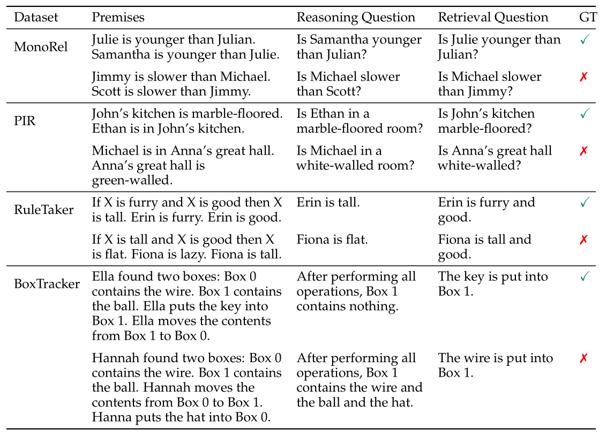
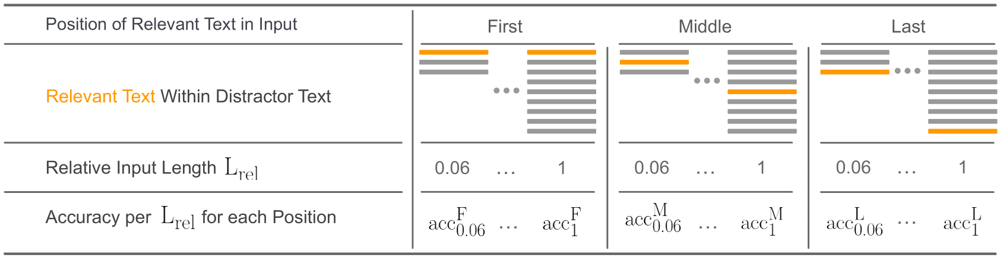

# Positional Biases Shift as Inputs Approach Context Window Limits

Large Language Models (LLMs) often struggle to use information across long inputs. Prior work has identified positional biases like the Lost in the Middle (LiM) effect—better performance when key information appears at the beginning (primacy) or end (recency) rather than in the middle—but long-context studies have not consistently replicated these effects. We address this by analyzing input length relative to each model’s context window and find that LiM is strongest when inputs occupy up to 50% of that window. Beyond that point, primacy weakens while recency remains relatively stable, effectively eliminating LiM and revealing a distance-based bias where performance is better when relevant information is closer to the end. Our results also suggest that successful retrieval is a prerequisite for reasoning, and that positional biases in reasoning are largely inherited from retrieval, with implications for long-context tasks, benchmark design, and evaluation.


<p align="center">
  
</p>

# Key Findings
  - Analysis of positional biases using **relative input length** (proportion of a model’s context window) rather than absolute lengths across models.
  - Positional biases are consistent across models when analyzed relative to a model's context window size. 
  - LiM is strongest in input lengths up to 50% of a models context window size.
  - With growing input size, primacy bias increasingly collapses, while the recency bias remains stable. This results in a more distance-based bias, i.e. accuracy higher when evidence is nearer the end.
  - Positional biases in reasoning, specifically the LiM effect, appear to be largely inherited from retrieval.

 <!--
# Dataset: Retrieval-Reasoning Minimal Pairs

We use MonoRel, PIR, and Simplified RuleTaker from [Levy et al., 2024](https://arxiv.org/abs/2402.14848) and the BoxTracker entity-tracking dataset from [Kim & Schuster, 2023](https://arxiv.org/abs/2305.02363). We adapt them - adding retrieval-only questions (answers that do not require reasoning, only locating information in the input) and generating new BoxTracker sequences using their framework.

We end up with **reasoning-retrieval minimal pairs** that allows us 1) to compare reasoning and retrieval directly and 2) to investigate the dependency between reasoning and retrieval.

<p align="center">
  
</p>

# Code Usage
🚧 **In Progress** 🚧  
-->

# Putting Positional Biases in Relation to Context Window Size 

We probe positional bias by varying two factors: 
1. The input length $L_{base}$ as a fraction of a model’s context window $L_{max}$: $L_{rel}=\frac{L_{base}}{L_{max}}.$ We test relative input lengths $L_{rel}$ ∈ {0.06, 0.12, 0.25, 0.38, 0.5, 0.75, 1.0}.
2. Where the relevant text appears - first, middle and last - within distractors.

For each position and $L_{\text{rel}}$, we pad the instance to the target length and measure accuracy. This setup isolates positional effects and makes results comparable across models with different window sizes as inputs approach the limit; see the paper for full details.

<p align="center">
  
</p>

## Citation
```bash
@inproceedings{veseli2025positional,
  title={Positional Biases Shift as Inputs Approach Context Window Limits},
  author={Veseli, Blerta and Chibane, Julian and Toneva, Mariya and Koller, Alexander},
  booktitle={Proceedings of the Conference on Language Modeling (COLM)},
  year={2025}
}
